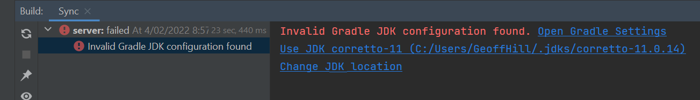
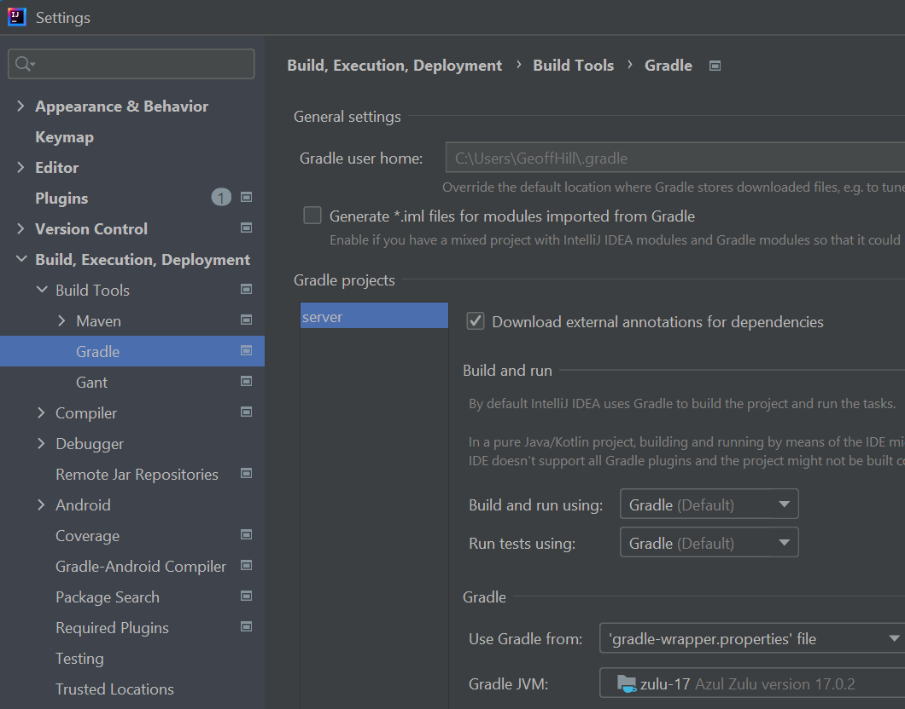
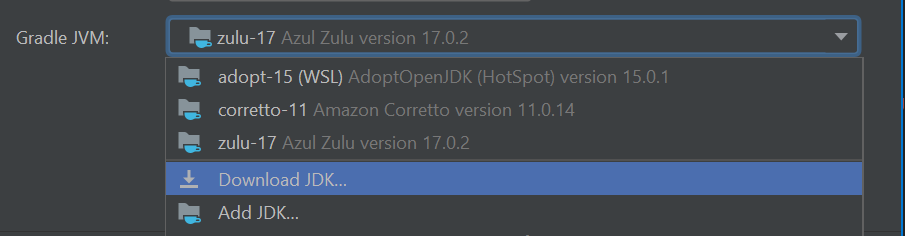
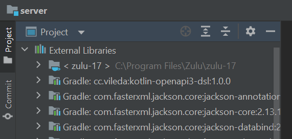
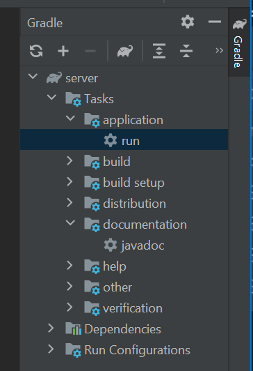
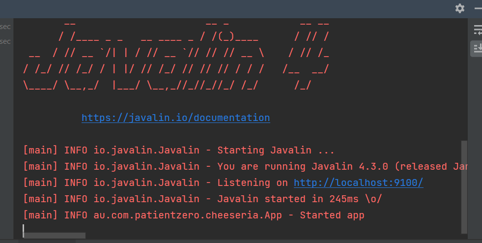

# IntelliJ IDEA Setup Guide

IntelliJ is pretty simple, and has decent support for downloading and installing a JVM for the project if you haven't got a Java 17 at this stage.

This description assumes:
- The IDE has been installed, and you are basically familiar with how it works. If you have problems, make sure it is the 20

# Getting started

Importing the app to Intellij usually just means **File->Open**, and selecting the build.gradle from the server directory. If prompted, choose to treat it as a Project, not just edit the file.

If the JDK17 has not been linked to IntelliJ you will see this problem.

Click on that and you will see this more detailed view.

And if you now click on "Open Gradle Settings", you will get a panel to configure Gradle. Everything can be left at defaults except the Gradle JVM at the bottom.

Select a pre-detected Java 17, or click "DownLoad JDK" to find and install one.

Once you have a JDK17 selected, close the panel with "OK" and then choose **File->Restart IDE** from the top menu. It will restart, open your project, and this time Gradle sync should succeed. You will be able to see this.

Now open up the gradle panel, click "Run" and you are good to go.

