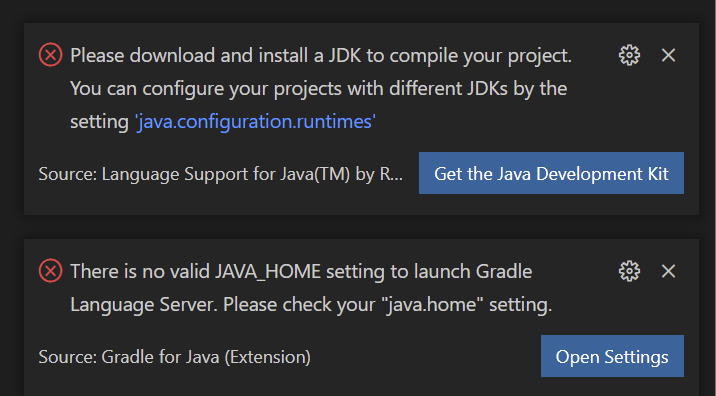
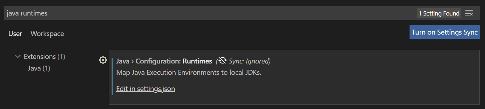
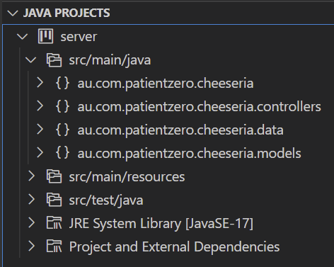
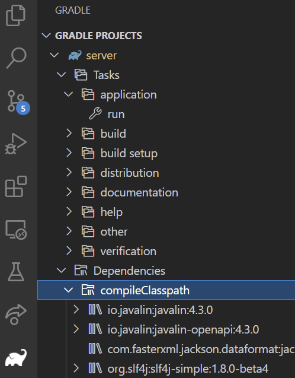
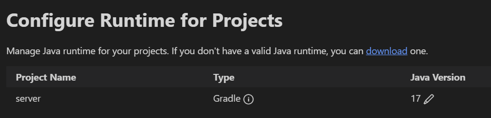

# VSCode Setup Guide

This description assumes:
- There is an installed JDK 17 on your machine, as described in the [Server README](../README.md).
- The IDE has been installed, and you are basically familiar with how it works.

You can open server folder in VSCode and it will (eventually) be imported as a java project. 

#### 1. Install extensions

To develop the server, we recommend 2 extensions:
- Extension Pack for Java
- Gradle for Java

Once you enable these you will probably see the following two error notifications.


The first of these is from the Java Language Server, and hte second from the Gradle extension.

#### 2. Tell VSCode About your Java Runtime
Go to **File->Preferences->Settings**

Search for `java runtimes` like this:

And click on `Edit in settings.json`.

Create or update the "java.configuration.runtimes array so it looks something like this, being mindful that it must be valid JSON.
```json
    "java.configuration.runtimes": [
      {
        "name": "JavaSE-17",
        "path": "C:\\Program Files\\Zulu\\zulu-17",
      },
      ... possibly more runtimes      
    ],

```
Save the file, then Restart VS Code. This time only the gradle warning will appear, and after some time you will see a message about importing projects. Finally you should see something like this in your explorer bar.


Gradle should now pick this up and import it as a Gradle Project. If it works you should see something this, after clicking on the "Elephant".




Also, if you invoke the command pallette (CONTROL-SHIFT-P on windows, COMMAND-SHIFT-P on Mac), then search for `Java: Configure Java Runtime`, then you should see your project, recognised as a Gradle Project, and built with a Java 17, like this:




